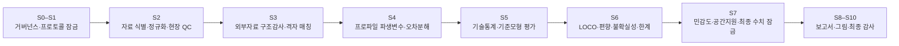
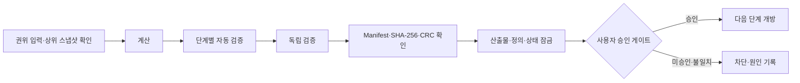

# 서부 북극해 엽록소의 대표성과 위성 관측 한계

**2026 극지데이터 경진대회 · 데이터 분석 및 재현성 거버넌스 기록**

2015–2023년 KPDC/ARAON 서부 북극해 하계 항차의 수직 프로파일을 이용하여  
표층 Chl-a의 수주 대표성, SCM 수직구조, 항차 외부 예측성능과 MODIS 관측가능성을 평가한 연구 프로젝트

---

> [!IMPORTANT]
> 이 공개 저장소는 **문서화와 통제된 산출물 공개를 위한 저장소**입니다.  
> 원본 실행 스크립트, 내부 검증 스냅샷, 오케스트레이션 상태파일 및 약 **14,263개·18.1 GB** 규모의 원자료 전체는 공개하지 않습니다. 따라서 이 저장소는 복제 후 즉시 실행하는 범용 소프트웨어 패키지가 아니며, 저장소만으로 원자료부터 최종 결과까지 완전 재실행할 수 있다고 주장하지 않습니다.

## Project Title & Overview

여름철 서부 북극해에서는 성층과 아표층 엽록소 최대층(Subsurface Chlorophyll Maximum, SCM)의 발달로 표층 엽록소-a(Chl-a)가 0–100 m 수주 전체의 엽록소량을 충분히 대표하지 못할 수 있습니다.

본 연구는 **2015–2023년 9개 하계 항차에서 확보한 200개 수직 프로파일**을 정점 방문별 분석단위로 구성하고, 다음 네 층위를 분리해 평가했습니다.

1. 표층 균일가정의 구조적 대표성 오차
2. 표층정보 기반 회귀모형의 항차 외부 예측성능
3. SCM 수직구조와 표층 대표성 한계의 관측적 정합성
4. MODIS–현장 대응자료의 관측가능성

### 핵심 결과

| 지표 | 결과 |
|---|---:|
| 0–100 m 적산 Chl-a 주요 분석집합 | 77 |
| SCM 출현 및 중앙 수심 | 71/77, 40.0 m |
| 직접 적산값/표층 균일 적산값 중앙비 | 2.776 |
| 표층 균일가정의 과소대표 | 64/77 |
| 표층 단순회귀모형 LOCO MAE / pooled OOF R² | 0.543 / 0.155 |
| 90% PI 포함률 / 원척도 폭 중앙값 | 0.883 / 101.95 mg Chl-a m⁻² |
| MODIS 주 분석 대응표본 | N=0 |

MODIS 주 분석의 N=0은 알고리즘 정확도가 낮다는 결과가 아니라, 설정한 시공간·품질·해빙 조건에서 정확도를 평가할 유효 현장–위성 대응표본이 형성되지 않았다는 결과입니다. 모든 결론은 해당 항차와 분석별 관측지원 범위에 한정됩니다.

---

## Pipeline Architecture & Workflow

아래 구조는 민감한 내부 경로와 제어 로직을 제외한 **개념적 파이프라인**입니다.

### S5-1~S6 분석 오케스트레이션

| 단계 | 기능 | 다음 단계로 넘기는 통제 산출물 |
|---|---|---|
| S5-1 | 분석별 표본지원, 항차·연도·정점 구조와 metric-specific N 점검 | 표본지원 레지스트리와 평가가능성 게이트 |
| S5-2 | 항차·해역·수심대별 수직구조 기술통계 | 수직구조 요약 및 소표본·교락 경고 |
| S5-3 | MODIS 주 분석과 조건완화 진단자료의 분리 | 주 분석 N=0 잠금 및 표본소진 기록 |
| S5-4 | 표층 균일 고정식의 구조적 기준오차 평가 | 고정식 성능·편향·예측구간 기록 |
| S5-5 | 표층 단순회귀·무정보 평균·저차원 보조모형 비교 | 동일 LOCO 기하의 기준모형 결과 |
| S5-6 | EDA, 항차 집중, 오차방향과 분석위험 재평가 | 과장·외삽 방지 경계 및 위험 레지스트리 |
| S5-7 | 기준모형·평가지표·분석경로 승인 잠금 | `PATH-BASELINE-LIMITS` 분석경로 고정 |
| S6 | 항차 단위 LOCO, 항차 군집 부트스트랩, 편향·PI·외부예측 한계 평가 | 최종 기준모형과 불확실성 범위 잠금 |

### Stage-Gate System과 락 체계

각 단계는 단순히 스크립트를 순차 실행하는 구조가 아니라, 다음 제어 절차를 통과해야 다음 단계가 개방됩니다.

핵심 통제는 다음과 같습니다.

- **Authority Lock**: 승인된 상위 단계 패키지, 분석계획, 정의와 임계값만 입력 권위로 사용
- **Definition Lock**: SCM, MLD, 적산규칙, MODIS 매칭, LOCO 기하와 성능지표의 사후 변경 차단
- **Validation Registry**: 단계별 validator가 `V001`–`V050`과 같은 식별자를 사용해 표본수, 산식, 부호, 경계조건, 단계상태와 파일 무결성을 점검  
  *(검증 ID의 실제 범위와 개수는 단계마다 다르며, 하나의 전역 50개 체크리스트를 의미하지 않음)*
- **Independent Verification**: 생산 코드와 분리된 검산 코드로 핵심 결과와 경계조건을 재확인
- **Content-Addressed Lineage**: 상위 패키지, 개별 파일 manifest와 최종 아카이브를 SHA-256 다이제스트로 연결하고 ZIP CRC를 교차 확인
- **State-Transition Lock**: 다음 단계 개방 여부, 승인대기, 차단사유와 최종 수치 잠금을 상태 스냅샷으로 관리

여기서 락(lock)은 데이터베이스의 ACID 잠금이 아니라, **단계 산출물과 다음 단계 상태전이를 통제하는 운영상 트랜잭션형 잠금**을 뜻합니다.

---

## 🔒 Code Availability & Technical Security Governance

### 공개정책

원본 실행 코드는 **통제된 비공개 저장소(Private Repository)**에서 관리하며, 퍼블릭 저장소에는 직접 게시하지 않습니다. 이는 단순한 저작권 표명이나 소스 비공개 선언이 아니라, 다음 네 가지 기술·거버넌스 요구에 따른 통제입니다.

### 1. 시스템 토폴로지 및 인프라 보안  
**Topology & Infrastructure Security**

원본 스크립트에는 `/mnt/data/...` 형식의 물리적 마운트 경로, 단계별 작업영역, 상위 스냅샷 위치, 내부 파일명 규칙과 데이터 분할구조가 포함되어 있습니다.

경로 문자열 자체가 인증정보는 아니지만, 다수의 경로·파일명·입출력 관계가 결합되면 다음 정보가 노출될 수 있습니다.

- 저장소와 마운트 볼륨의 논리적 배치
- 원자료·가공자료·검증자료의 분리 구조
- 내부 작업공간과 스냅샷 저장방식
- 단계별 데이터 이동 및 참조 순서
- 외부자료와 내부자료의 결합 지점

이는 직접적인 자격증명 유출과는 다르지만, 공격표면 정찰과 시스템 구조 추론에 이용될 수 있는 **정보노출 취약성(Information Disclosure Vulnerability)**을 증가시킵니다. 공개본에서는 물리적 경로, 비공개 URL, 내부 식별자와 작업공간 메타데이터를 제거합니다.

### 2. 자동화 오케스트레이션 및 파이프라인 무결성  
**Orchestration Architecture & Pipeline Integrity**

원본 코드는 과학계산만 수행하지 않습니다. 단계 개방·차단, 상위 권위 검증, 독립 검산, 패키징, manifest 갱신과 승인대기 상태를 함께 관리하는 프로젝트 전용 제어계층을 포함합니다.

주요 통제요소는 다음과 같습니다.

- 단계별 Stage-Gate와 다음 단계 차단 상태
- 잠금 분석계획과 임계값 불변성 검사
- 상위 패키지·개별 파일·최종 ZIP의 SHA-256 무결성 계보
- 단계별 `V001`–`V050` 계열 자동 검증 레코드
- 생산 코드와 독립 verifier의 이중 검증
- CRC, manifest 누락·추가·해시 불일치 검사
- 최종 수치·주장경계·반올림·보고배치 레지스트리 잠금

이 구현은 단순한 분석 예제가 아니라 **오케스트레이션 제어면(control plane)**입니다. 실행 맥락이 제거된 채 일부만 공개되면 검증순서를 우회하거나 승인되지 않은 산출물을 정상결과처럼 취급하는 오용이 발생할 수 있습니다. 따라서 공개 README에는 개념적 흐름만 제시하고, 상태전이 구현·검증 스냅샷·락 로직은 비공개로 유지합니다.

### 3. 폐쇄형 런타임 종속성과 정밀 재현성  
**Closed Runtime Dependencies & Precision Reproducibility**

일부 역사적 스크립트는 다음 환경에 결합되어 있습니다.

- 마운트 기반 파일시스템과 단계별 상위 패키지
- 내부 행정 JSON·검증 스냅샷·잠금 분석계획
- 원 실행환경에서 제공된 `artifact_tool`
- 특정 폰트, 래스터·HDF·공간참조 라이브러리와 파일구조
- 이전 단계 산출물의 정확한 바이트와 manifest 상태

따라서 소스만 공개해도 범용 Windows/Linux 환경에서 동일하게 실행되지 않습니다. 경로를 단순 치환하는 것만으로는 상위 스냅샷, 잠금상태와 내부 런타임 의존성이 복원되지 않으며, 부분 실행은 과학값보다 먼저 **계보 단절과 허위 재현성**을 만들 수 있습니다.

이 프로젝트는 공개 저장소에서 “코드가 보인다”는 형식적 공개보다, 검증 가능한 방법 설명과 결과 추적범위를 정확히 명시하는 방식을 우선합니다.

### 4. 데이터 거버넌스와 통제된 공개  
**Data Governance, Data Minimization & Controlled Disclosure**

원자료와 내부 계보자료는 목적 제한, 최소 공개, 최소권한과 역할분리 원칙으로 관리합니다.

- 약 14,263개·18.1 GB의 원자료는 별도 비공개 저장공간에 보관
- 비공개 Google Drive 주소와 접근 링크는 README에 게시하지 않음
- 원자료 파일명·경로·내부 식별자가 불필요하게 외부로 확산되지 않도록 공개본을 별도 정제
- 원자료, 내부 검증 스냅샷, 제어 로직과 공개 가능한 파생 산출물을 분리
- 공개 전 경로·민감 메타데이터·내부 상태정보를 제거하는 disclosure review 수행

이 정책은 확인되지 않은 라이선스 제한을 임의로 주장하기 위한 것이 아닙니다. 확인된 사실인 **대용량 원자료의 비공개 보관, 공개 저장소 미포함, 내부 경로·제어정보의 최소 공개**에 근거합니다. 또한 특정 ISO·NIST 인증을 주장하는 문구가 아니라, 본 프로젝트에 적용한 데이터 거버넌스 통제입니다.

### 공개·비공개 범위

| 구분 | 공개 범위 |
|---|---|
| 연구목적·방법·핵심 결과 | 공개 |
| 고수준 파이프라인과 검증철학 | 공개 |
| 경로와 민감 메타데이터를 제거한 승인 산출물 | 공개 가능 범위에서 선택적 게시 |
| 원본 실행 스크립트 | 비공개 |
| 내부 오케스트레이션·상태전이·락 구현 | 비공개 |
| 내부 검증 스냅샷·상위 패키지 계보 | 비공개 |
| 원자료 전체와 비공개 Google Drive 링크 | 비공개 |
| API 키·토큰·인증파일 | 공개 금지 |

공개 저장소의 실제 제공범위는 저장소에 존재하는 파일을 기준으로 하며, 이 README는 존재하지 않는 실행파일이나 다운로드 경로를 전제로 하지 않습니다.

---

## Data Availability

### 사용 자료

현장자료는 KPDC/ARAON 병입 Chl-a, CTD 수온·염분·압력과 형광, 수심별 영양염으로 구성됩니다. 외부자료는 NASA MODIS-Aqua Level-3 Chl-a, NOAA/NSIDC Sea Ice Concentration CDR Version 6, NOAA OISST v2.1과 GEBCO_2026 Grid를 사용했습니다. ERA5는 자료 확보가 완료되지 않아 최종 분석에 포함하지 않았습니다.

상세 자료원, 제품 버전, DOI와 참고문헌은 대회 제출 보고서를 참조하십시오.

### 원자료 공개 범위

- 파일 수: 약 14,263개
- 총용량: 약 18.1 GB
- 보관 위치: 별도 비공개 Google Drive
- 공개 저장소 포함 여부: 미포함
- README 내 비공개 접근 링크: 제공하지 않음

원자료 전체가 없으므로 이 저장소만으로 raw-to-final 전체 계산을 완전 재실행할 수 없습니다. 공개 가능한 파생 수치표가 게시되는 경우에도 이는 원본 NetCDF, GeoTIFF, Excel, 이미지와 메타데이터 전체를 대체하지 않습니다.

---

## Reproducibility Scope

본 프로젝트의 공개 재현성 목표는 **완전 실행 복제(full rerun)**가 아니라, 연구설계·분석경계·결과수치의 감사가능성(auditability)과 추적가능성(traceability)을 제공하는 것입니다.

| 재현성 항목 | 공개 저장소만으로 가능한 범위 |
|---|---|
| 연구질문·자료위계·품질기준 검토 | 가능 |
| 핵심 결과와 일반화 한계 검토 | 가능 |
| 고수준 파이프라인과 Stage-Gate 구조 이해 | 가능 |
| 공개된 정제 산출물의 수치 검토 | 해당 파일이 게시된 경우 가능 |
| 원본 코드의 정적 검토 | 불가 |
| 내부 validator·독립 verifier 전체 실행 | 불가 |
| 원자료부터 최종 산출물까지 전체 재실행 | 불가 |
| 내부 스냅샷과 동일한 단계별 패키지 재생성 | 불가 |

난수설정의 구체값은 공개 README에 반복 기재하지 않습니다. 관련 설정은 대회 제출 보고서의 연구방법을 참조하십시오.

---

## Execution Environment Record

| 구분 | 기록 |
|---|---|
| 개발 운영체제 | Windows 10 |
| Python | 3.13.5 |
| IDE | Visual Studio Code |
| 개발 보조도구 | Codex |
| 연산방식 | CPU 기반 |
| GPU | GPU 프레임워크·CUDA 호출을 사용하지 않았으며 필수요건이 아님 |

Visual Studio Code와 Codex는 각각 IDE와 개발 보조도구이며 Python 런타임 또는 분석 라이브러리가 아닙니다. 운영체제의 세부 빌드번호와 CPU 모델은 검증된 공개 실행기록으로 고정하지 않았으므로 이 README에 기재하지 않습니다.

<strong>기록된 직접 사용 제3자 패키지</strong>

| 패키지 | 버전 |
|---|---:|
| NumPy | 2.3.5 |
| pandas | 2.2.3 |
| SciPy | 1.17.0 |
| scikit-learn | 1.8.0 |
| GSW-Python | 3.6.23 |
| h5py | 3.15.1 |
| rasterio | 1.5.0 |
| pyproj | 3.7.2 |
| Shapely | 2.1.2 |
| matplotlib | 3.10.8 |
| basemap | 2.0.0 |
| PyMuPDF | 1.26.7 |
| Pillow | 12.2.0 |

`artifact_tool`은 일부 단계별 Excel workbook 생성에 사용된 실행환경 전용 모듈이며, 공개 PyPI 패키지로 버전을 고정하지 않습니다.

원본 코드가 비공개이므로 공개 README에는 실행되지 않는 설치·실행 명령을 제시하지 않습니다.

---

## Generative AI Use

생성형 AI는 Python 코드 초안과 디버깅, 영문 메타데이터·문헌 번역, 도메인 학습 및 문서 정합성 점검에 보조적으로 사용했습니다.

연구질문과 품질기준 결정, 코드 실행, 원자료 대조, 통계치 검증, 결과 해석과 결론 작성은 연구자가 수행했습니다. AI가 생성한 코드와 문장은 단위, 결측처리, 경계조건, 산식, 근거와 재현성을 검토한 뒤 수정했으며, 원자료 변조나 임의 수치 생성은 허용하지 않았습니다.

---

상세 연구방법, 직접 추론범위, 자료제품의 출처와 참고문헌은 2026 극지데이터 경진대회 제출 보고서에 수록되어 있습니다.
